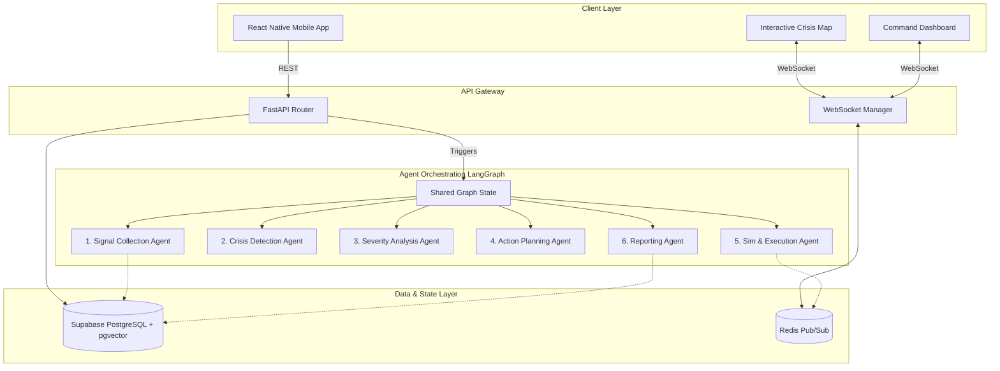
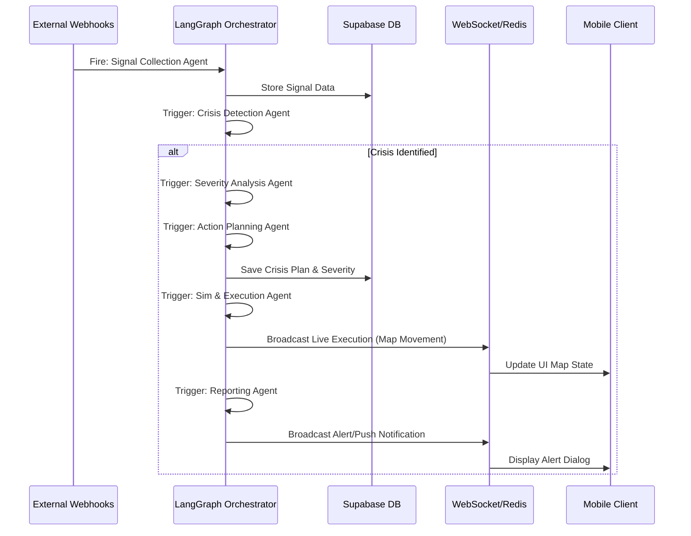

# CIRO (Crisis Intelligence & Response Orchestrator)
## System Architecture & Design Document

This document outlines a production-grade, yet hackathon-friendly architecture for **CIRO**, an AI-powered multi-agent crisis detection and response platform.

---

## 1. Recommended Tech Stack
To ensure the system is **scalable but hackathon-friendly**, we focus on rapid-iteration tools that have high ceilings for production scaling.

* **Mobile Frontend:** **React Native (Expo)** - Allows rapid development of iOS and Android apps simultaneously. Easily integrates with **Mapbox GL** for rich, interactive crisis mapping.
* **Backend APIs & Orchestration:** **Python (FastAPI)** - Ideal for asynchronous agentic workflows, high-performance API routing, and AI library ecosystem compatibility.
* **Agent Framework:** **LangGraph / LangChain** - Provides stateful orchestration for multi-agent loops, ensuring agents can share context without losing memory.
* **Database & Auth:** **Supabase (PostgreSQL)** - Serverless, instant setup. We will utilize `pgvector` for storing embedding representations of crisis signals (RAG capabilities).
* **Real-time / Messaging:** **Redis** or **Supabase Realtime** - Crucial for pushing live simulated units and alerts to the mobile client via WebSockets.
* **AI Models:** **Gemini 3.1 Pro / Flash** - High reasoning capabilities for planning and severity analysis, with fast inference for real-time signal processing.

---

## 2. Architecture Diagram

The system is separated into four primary layers: Frontend, Backend API, Agentic Orchestration, and Data.



### Explanation:
1. **Client Layer:** Users and command centers interact with the React Native app. WebSockets maintain a persistent connection for live map updates (e.g., seeing emergency vehicles move).
2. **API Gateway:** FastAPI securely handles incoming HTTP requests and WebSocket connections, translating them into database queries or triggering the LangGraph agent state machine.
3. **Agent Orchestration:** LangGraph manages the state. As one agent finishes its task, the state is updated, routing to the next appropriate agent based on conditional edges.
4. **Data Layer:** Supabase holds the persistent truth (Crises, Users, Plans), while Redis manages the volatile, high-frequency pub/sub data (live tracking, instant agent chatter).

---

## 3. Agent Communication Workflow

The Multi-Agent system relies on a directed cyclic graph (LangGraph) where state is passed between agents.

1. **Signal Collection Agent:** 
   * **Role:** Operates continually. Connects to Twitter APIs, Weather APIs, Traffic webhooks.
   * **Action:** Cleans raw JSON/text, extracts location entities, generates vector embeddings, and stores them in the DB as `NormalizedSignals`.
2. **Crisis Detection Agent:**
   * **Role:** The anomaly detector.
   * **Action:** Uses semantic search to find clustered signals in similar times/locations. If "traffic jam" aligns with "smoke reported on Twitter" and "high temperature reading", it formally proposes a `CrisisEvent`.
3. **Severity Analysis Agent:**
   * **Role:** Risk assessor.
   * **Action:** Analyzes the `CrisisEvent`. Cross-references population density and historical data. Assigns a Severity Score (1-10), calculates the blast/impact radius, and determines required resources.
4. **Action Planning Agent:**
   * **Role:** The tactical brain.
   * **Action:** Generates a step-by-step Standard Operating Procedure (SOP). Formulates an array of discrete `Tasks` (e.g., "Dispatch Engine 4", "Issue shelter-in-place for ZIP 90210").
5. **Simulation & Execution Agent:**
   * **Role:** The driver.
   * **Action:** Takes the Action Plan and translates it into simulated API actions. It calculates travel times for simulated units, publishes coordinates to Redis (so the mobile map updates), and fires automated webhooks.
6. **Reporting Agent:**
   * **Role:** The communicator.
   * **Action:** Continuously drafts Situation Reports (SitReps). Translates complex agent telemetry into human-readable push notifications for civilians and detailed briefs for first responders.

---

## 4. Event Flow



---

## 5. Database Schema (Supabase)

```sql
-- Core Tables
CREATE TABLE users (
    id UUID PRIMARY KEY,
    role VARCHAR, -- 'civilian', 'responder', 'commander'
    fcm_token VARCHAR, -- For push notifications
    current_location GEOMETRY(Point, 4326)
);

CREATE TABLE signals (
    id UUID PRIMARY KEY,
    source_type VARCHAR, -- 'social', 'weather', 'traffic'
    raw_content TEXT,
    normalized_summary TEXT,
    embedding VECTOR(768),
    location GEOMETRY(Point, 4326),
    created_at TIMESTAMP
);

CREATE TABLE crises (
    id UUID PRIMARY KEY,
    title VARCHAR,
    severity_score INT, -- 1 to 10
    status VARCHAR, -- 'detected', 'active', 'contained', 'resolved'
    impact_polygon GEOMETRY(Polygon, 4326),
    created_at TIMESTAMP
);

CREATE TABLE action_plans (
    id UUID PRIMARY KEY,
    crisis_id UUID REFERENCES crises(id),
    plan_details JSONB, -- Step by step agent output
    status VARCHAR
);

CREATE TABLE simulation_logs (
    id UUID PRIMARY KEY,
    crisis_id UUID REFERENCES crises(id),
    unit_type VARCHAR, -- e.g., 'fire_truck', 'ambulance'
    current_location GEOMETRY(Point, 4326),
    timestamp TIMESTAMP
);
```

---

## 6. API Structure (FastAPI)

### Webhook / Ingestion
* `POST /api/v1/ingest/social` - Receives mock social media firehose data.
* `POST /api/v1/ingest/weather` - Receives NOAA/Weather alerts.

### Crisis Management
* `GET /api/v1/crises` - List active crises (filter by location/status).
* `GET /api/v1/crises/{id}` - Get full details, plan, and SitRep.
* `POST /api/v1/crises/{id}/override` - Allow human commanders to edit the AI Action Plan.

### Agent Control (Hackathon Utilities)
* `POST /api/v1/agents/trigger-simulation` - Force the Execution Agent to start moving map pins.
* `GET /api/v1/agents/state/{crisis_id}` - View the raw LangGraph state for debugging the AI thought process.

### Real-Time Sockets
* `WS /ws/map/{region_id}` - Subscribe to live unit tracking and localized alerts.

---

## 7. Deployment Plan (Hackathon Phase)

1. **Backend (FastAPI + LangGraph):**
   * **Host:** **Render** or **Railway**. Both offer 1-click Python deployments from GitHub and handle WebSockets seamlessly.
2. **Database & Auth:**
   * **Host:** **Supabase**. Free tier provides enough PostgreSQL connections, pgvector, and Auth for a hackathon.
3. **Mobile Client:**
   * **Host:** **Expo Application Services (EAS)** / Expo Go. Allows judges/teammates to scan a QR code and immediately test the app on their physical devices without going through App Stores.
4. **Message Broker:**
   * **Host:** **Upstash Redis** (Serverless Redis) for handling the Pub/Sub of simulation map movements without managing infrastructure.
